# 🚀 PrepAI – AI Powered Placement Preparation Platform

PrepAI is a full-stack MERN application designed to help students prepare for placements efficiently. It provides a centralized platform to track DSA, Aptitude, Interview Preparation, Projects, Resume progress, and includes an AI Coach for personalized guidance.

---

## 🌐 Live Demo

### Frontend
https://prep-ai-iota-blue.vercel.app

### Backend API
https://prepai-project-x5dz.onrender.com

---

## ✨ Features

### 👤 Authentication
- User Registration
- Secure Login
- JWT Authentication
- Protected Routes
- Change Password

---

### 📊 Dashboard
- Personalized Dashboard
- Login Streak Tracker
- Profile Completion
- Overall Progress
- Daily Motivation Card
- Placement Tips
- Progress Statistics

---

### 💻 DSA Tracker
- Add Problems
- Update Status
- Delete Problems
- Track Solved & Pending Problems

---

### 🧠 Aptitude Tracker
- Add Topics
- Track Progress
- Edit/Delete Entries

---

### 🎯 Interview Tracker
- Store Interview Questions
- Track Preparation Status

---

### 📁 Project Tracker
- Manage Personal Projects
- Track Completion

---

### 📄 Resume Tracker
- Resume Status Management

---

### 🤖 AI Coach
- AI Powered Placement Assistant
- Career Guidance
- Resume Suggestions
- Interview Preparation
- DSA Guidance
- Motivation & Learning Assistance

---

### 👨‍💼 Admin Panel
- Admin Dashboard
- View All Users
- Delete Users
- Platform Statistics

---

## 🛠️ Tech Stack

### Frontend
- React.js
- React Router DOM
- Axios
- React Hot Toast
- CSS3

### Backend
- Node.js
- Express.js
- MongoDB
- Mongoose
- JWT
- bcrypt

### AI
- Groq API

### Deployment
- Frontend → Vercel
- Backend → Render
- Database → MongoDB Atlas

---

## 📂 Project Structure

```
PrepAI
│
├── client
│   ├── src
│   ├── components
│   ├── pages
│   ├── api
│   └── styles
│
└── server
    ├── config
    ├── controllers
    ├── middleware
    ├── models
    ├── routes
    └── services
```

---

## ⚙️ Installation

### Clone Repository

```bash
git clone https://github.com/nehabaghele01/PrepAI.git
```

---

### Backend

```bash
cd server
npm install
npm run dev
```

---

### Frontend

```bash
cd client
npm install
npm run dev
```

---

## 🔑 Environment Variables

### Backend (.env)

```env
PORT=5000

MONGO_URI=YOUR_MONGODB_URI

JWT_SECRET=YOUR_SECRET_KEY

GROQ_API_KEY=YOUR_GROQ_API_KEY
```

---

### Frontend (.env)

```env
VITE_API_URL=YOUR_BACKEND_URL/api
```

---

## 📸 Screenshots

### 🔐 Login Page

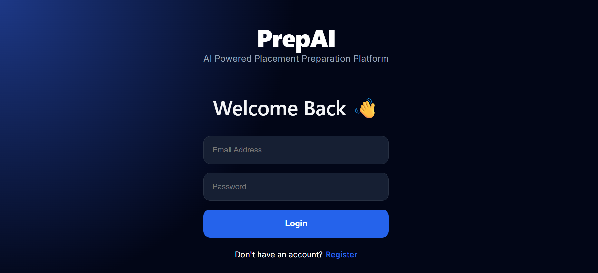

---

### 📝 Register Page

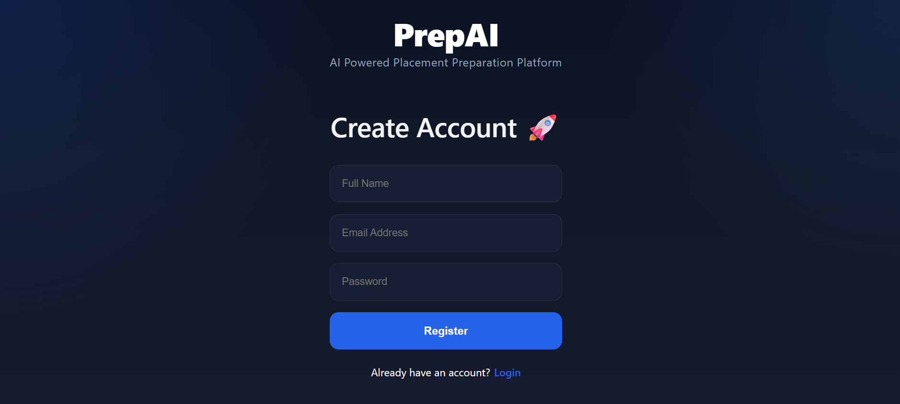

---

### 📊 Dashboard

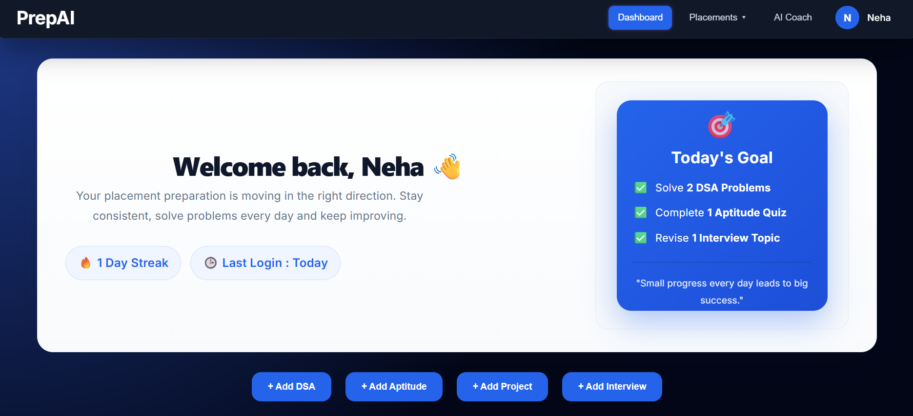

---

### 📈 Dashboard Statistics

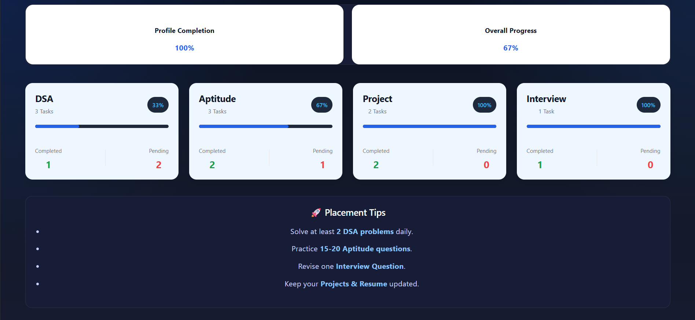

---

### 💻 DSA Tracker

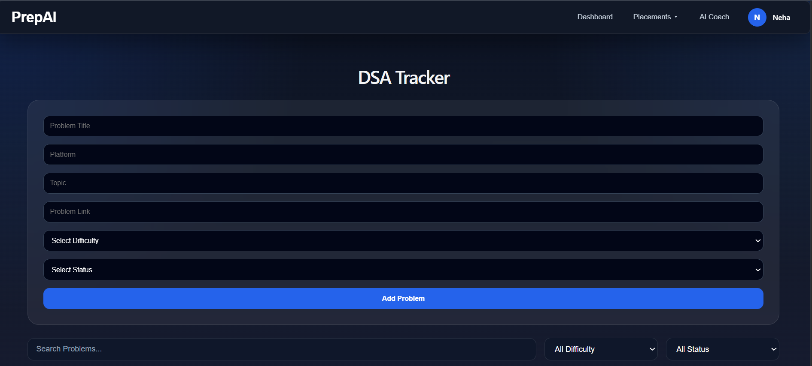

---

### 🧠 Aptitude Tracker

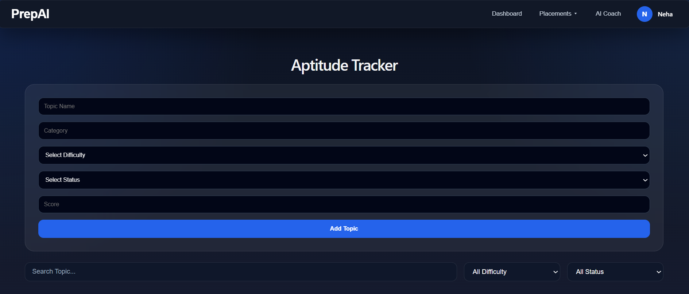

---

### 🎯 Interview Tracker

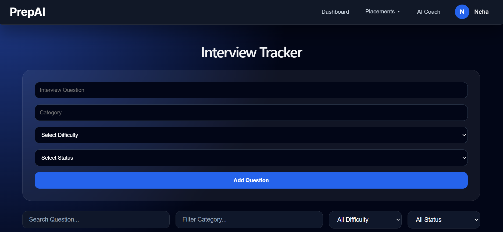

---

### 📁 Project Tracker

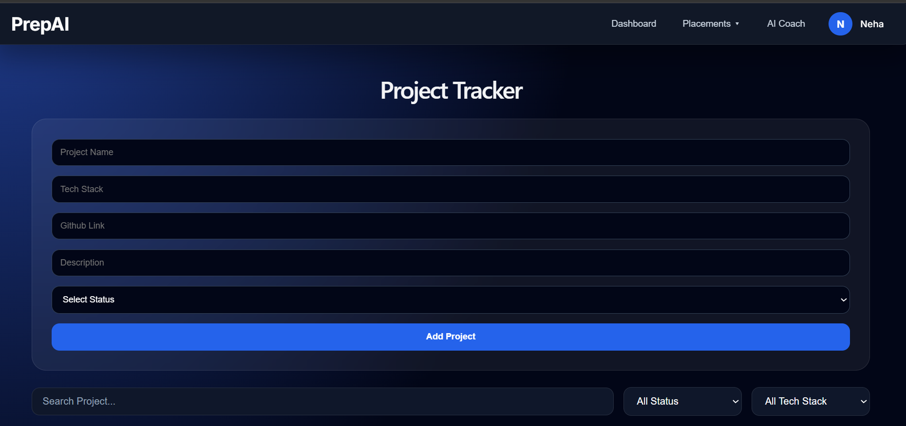

---

### 📄 Resume Tracker

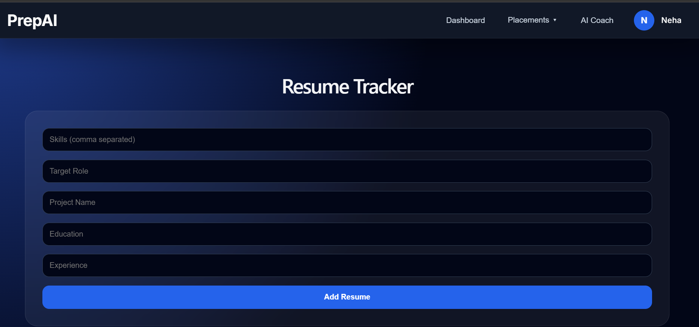

---

### 🤖 AI Coach

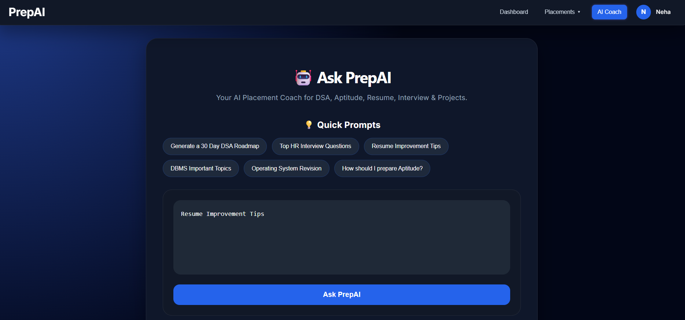

---

### 👤 Profile Page

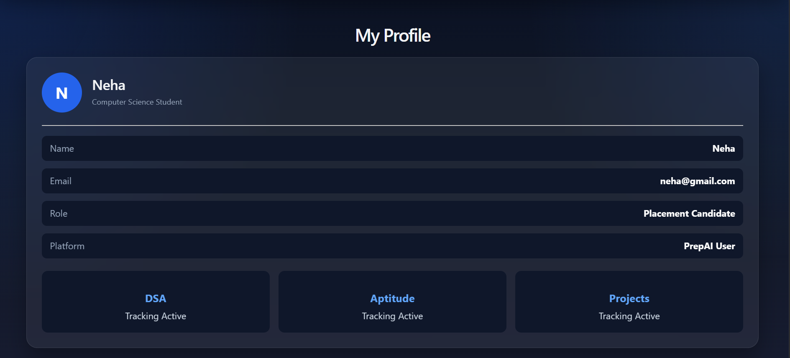

---

### 👨‍💼 Admin Dashboard

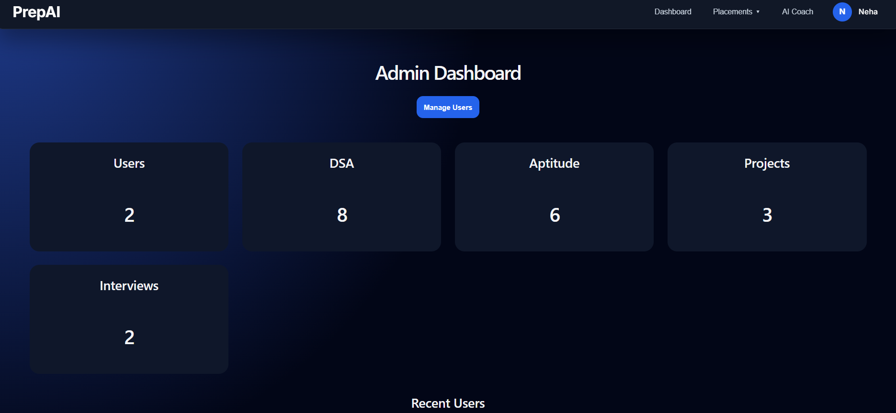

---

### 👥 Admin User Management

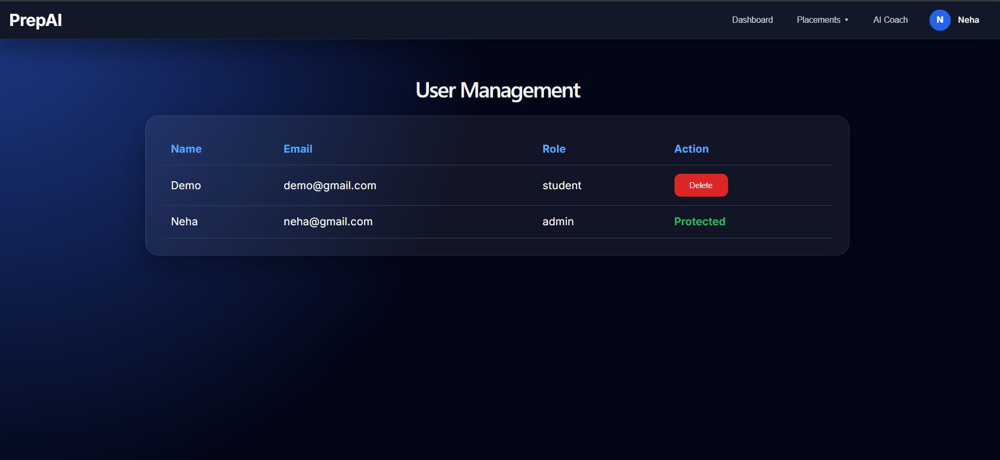

## 🎯 Future Improvements

- AI Mock Interview
- Company-wise Question Bank
- Coding Contest Tracker
- Notifications & Reminders
- Dark/Light Theme
- Analytics Dashboard
- Email Verification
- Forgot Password

---

## 👩‍💻 Author

**Neha Baghele**

B.Tech CSE

GitHub:
https://github.com/nehabaghele01

LinkedIn:
https://www.linkedin.com/in/neha-baghele-621050268/

---

